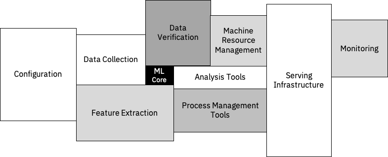

# Data Science - Best Practices &middot; 

## Table of Content

- [Chapter 1 - Introduction](./readme.md#chapter-1---introduction)
- [Chapter 2 - Project Team (Design)](./project_team.md#chapter-2---project-team)
- [Chapter 3 - Architecture (Deploy)](./architecture.md#chapter-3---architecture)
- [Chapter 4 - Source Code (Engineer)](./source_code.md#chapter-4---source-code)
- [Chapter 5 - Documentation (Engineer)](./documentation.md#chapter-5---documentation)
- [Chapter 6 - Versioning (Engineer)](./versioning.md#chapter-6---versioning)
- [Chapter 7 - Data Management (Engineer)](./data_management.md#chapter-7---data-management)
- [Chapter 8 - Dependency Management (Engineer)](./dependency_management.md#chapter-8---dependency-management)
- [Chapter 9 - Configuration Management (Engineer)](./configuration_management.md#chapter-9---configuration-management)
- [Chapter 10 - Testing (Engineer)](./testing.md#chapter-10---testing)
- [Chapter 11 - Quality Measurements (Monitor)](./quality_measurements.md#chapter-11---quality-measurements)
- [Chapter 12 - Model Training (Engineer)](./model_training.md#chapter-12---model-training)
- [Chapter 13 - Distribution (Deploy)](./distribution.md#chapter-13---distribution)
- [Chapter 14 - Cloud-Deployment (Deploy)](./cloud_deployment.md#chapter-14---cloud-deployment)
- [Chapter 15 - Edge Deployment (Deploy)](./edge_deployment.md#chapter-15---edge-deployment)
- [Chapter 16 - Monitoring (Monitor)](./monitoring.md#chapter-16---monitoring)
- [Chapter 17 - Automation (Scalability)](./automation.md#chapter-17---automation)
- [Chapter 18 - Scaling (Scalability)](./scaling.md#chapter-18---scaling)
- [Chapter 19 - Sizing (Scalability)](./sizing.md#chapter-19---sizing)
- [Chapter 20 - Security (Engineer)](./security.md#chapter-20---security)
- [Chapter 21 - Usage Recommendations (Scalability)](./recommendation.md#chapter-21---usage-recommendations)
- [License & Contributing](./license.md)

## Chapter 1 - Introduction

   
  "<a href="https://xkcd.com/1838/">Machine Learning</a>" by Randall Munroe is licensed under <a href="https://creativecommons.org/licenses/by-nc/2.5/">CC BY-NC 2.5</a>. 

The goal of this document is to enable you as a data scientist to develop a data science use case in a semi-professional setting to make it ready for production use. This means focusing on the versioning, scalability, monitoring and engineering of the solution.

### Prerequisites

#### Required Skills

- Python programming - Intermediate Level
- Data Science - Intermediate Level
- Shell, Terminal or CMD (command-line) - Beginner Level
- Git - Beginner Level

#### Tools

- [Python 3](https://www.python.org/downloads/) - Python 3.7
- IDE (Integrated Development Environment) - Our recommendations: [Visual Studio Code](https://code.visualstudio.com/) or [PyCharm Community Edition](https://www.jetbrains.com/pycharm/)

> **Q: Can I use Jupyter Notebooks as my IDE?**  
> A: No, since this is not an IDE. Also we feel that it tends to encourage bad coding practice, especially with beginners.
> For further details: [I don't like Notebooks - Joel Grus (YouTube)](https://www.youtube.com/watch?v=7jiPeIFXb6U)

> **Q: Can I use a plain text editor?**  
> A: Yes, if you feel that this is the best for you, then go for it.
> Just make sure that it is a plain text editor and not a rich-text editor.

> **Q: Can I use Anaconda?**
> A: No, Anaconda Free Version is only permitted for 'individual hobbyists, academics, non-profits, and small businesses' ([more details](https://www.anaconda.com/blog/anaconda-commercial-edition-faq)); You require commercial licensing to use Anaconda in a large enterprise.

#### IBM Services for AI at Scale background

      
  &copy; IBM

'IBM Services for AI at Scale' is a GBS offering, which aims at scaling current AI engagements and applications towards an enterprise setup.
It consists of multiple pillars, which are building up the overall offering:

- **Vision:** Addresses the AI and data strategy of a company and a potential transformation roadmap to make AI a key
component of the company's offering.
- **Operating Model:** When the journey and the plan is fixed, it is essential to define the how to execute and operate
- **Data and Technology:** In order to scale AI applications and environments, it is also key to incorporate a strong management
and eco system for the existing data.
- **Engineering and Operations:** This addresses the questions of engineering, deploying and monitoring the AI solution. It is the
most technical part of the offering and is the focus of this playbook.
- **Change Management:** The process to transform and change existing AI structures is addressed in this pillar.
- **People and Enablement:** To achieve maturity and scalability in AI it is essential to also cover the right skill set,
roles and team setup in the AI organization.

### The Role of Machine Learning in a Real World AI System

As outlined in the paper "[Hidden Technical Debt in Machine Learning Systems](https://papers.nips.cc/paper/2015/file/86df7dcfd896fcaf2674f757a2463eba-Paper.pdf)" AI systems can become very quickly very complex. Machine Learning itself is just a tiny portion of the overall AI system. Understanding the surrounding factors is the first step is managing the complexity and keeping the technical debt of such systems at bay. The aim of these Data Science Best Practices is to guide and help understand these factors.

## Need Help

Reach us at on Slack [#datascience-best-practices](https://slack.com/app_redirect?channel=CUZGJN43V) (IBM Internal)
