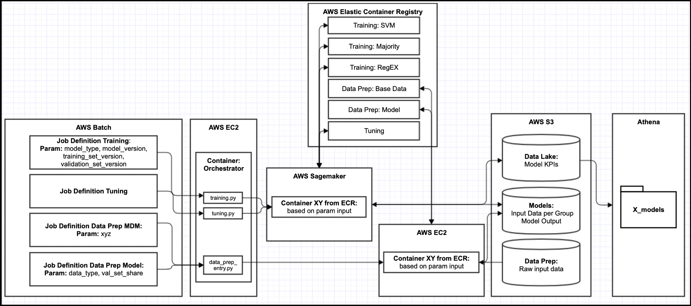

# Data Science - Best Practices &middot; 

## Table of Content

- [Chapter 1 - Introduction](./readme.md#chapter-1---introduction)
- [Chapter 2 - Project Team (Design)](./project_team.md#chapter-2---project-team)
- [Chapter 3 - Architecture (Deploy)](./architecture.md#chapter-3---architecture)
- [Chapter 4 - Source Code (Engineer)](./source_code.md#chapter-4---source-code)
- [Chapter 5 - Documentation (Engineer)](./documentation.md#chapter-5---documentation)
- [Chapter 6 - Versioning (Engineer)](./versioning.md#chapter-6---versioning)
- [Chapter 7 - Data Management (Engineer)](./data_management.md#chapter-7---data-management)
- [Chapter 8 - Dependency Management (Engineer)](./dependency_management.md#chapter-8---dependency-management)
- [Chapter 9 - Configuration Management (Engineer)](./configuration_management.md#chapter-9---configuration-management)
- [Chapter 10 - Testing (Engineer)](./testing.md#chapter-10---testing)
- [Chapter 11 - Quality Measurements (Monitor)](./quality_measurements.md#chapter-11---quality-measurements)
- [Chapter 12 - Model Training (Engineer)](./model_training.md#chapter-12---model-training)
- [Chapter 13 - Distribution (Deploy)](./distribution.md#chapter-13---distribution)
- [Chapter 14 - Cloud-Deployment (Deploy)](./cloud_deployment.md#chapter-14---cloud-deployment)
- [Chapter 15 - Edge Deployment (Deploy)](./edge_deployment.md#chapter-15---edge-deployment)
- [Chapter 16 - Monitoring (Monitor)](./monitoring.md#chapter-16---monitoring)
- [Chapter 17 - Automation (Scalability)](./automation.md#chapter-17---automation)
- [Chapter 18 - Scaling (Scalability)](./scaling.md#chapter-18---scaling)
- [Chapter 19 - Sizing (Scalability)](./sizing.md#chapter-19---sizing)
- [Chapter 20 - Security (Engineer)](./security.md#chapter-20---security)
- [Chapter 21 - Usage Recommendations (Scalability)](./recommendation.md#chapter-21---usage-recommendations)
- [License & Contributing](./license.md)

## Chapter 21 - Usage Recommendations

There is a wide variety of different architectural setups and flavours, the choice of tools is even larger. 
For a general recommendation on what to use for which use case it is important to consider a set of questions: 

- What is the size of the engagement?

It is essential to assess to expected size of the engagement before planning architecture and tool landscape for your
machine learning project. Typically the tendency should lean towards having more time to do the actual machine learning
work than the management of the necessary infrastructure. Cloud providers take over most of the management on different 
levels. There are different levels of abstraction (level of abstraction increasing from left to right:
Infrastructure as a Service (IaaS), Platform as a Service (PaaS), Software as a Service (SaaS).  
For smaller scale engagements it is easier to opt for SaaS offerings. Most of these offerings are easy to work with and 
offer an API, which can be integrated in the solution. Popular examples for this are Azure ML, Watson Studio or AWS 
Sagemaker. These software solutions offer the option to specify the scale of the machine for training, your training code
and the input data. The actual training, containerization and administration is taken over by the cloud provider.  
For larger scale engagements you might want to have the opportunity to manage and configure more yourself to meet the
detailed requirements. Therefore it might be handy to use other offerings by the cloud provider like a managed
Kubernetes service, a managed Spark environment or a managed database. But you still have to take care about containerization, 
data connections or versioning.  
If a cloud provider is not an option you might want to setup clusters and environments yourself with full flexibility
in configuration. This in return means that more effort needs to be spend to manage and administrate the infrastructure
and landscape.
 
- What is the size of the training data?

If the use case is considered to have big data requirements (large training data set), it might be necessary to introduce
Spark for data processing and learning. Spark is a cluster-based data processing platform for large scale use cases.
Spark brings its own machine learning libraries, which implement the common machine learning algorithms for distributed
computing. Therefore the workload can be scaled out and runtime decreased.
If your use case requires smaller training data sets only, it is probably fine to work with a smaller setup being a 
Kubernetes Cluster or Docker host or any other machine type defined in your SaaS offering.
  
- What is the current available architecture and tool landscape?

It is always important to assess the existing architecture and tool landscape before you start working and developing new
solutions. If there is an existing Github installation or a running Jenkins environment as well as a managed company-wide
Kubernetes cluster, it is definitely not necessary to start from scratch and reinvent the wheel. It is not necessary 
to startup a standalone instance for the machine learning use case. Rather the existing solutions can be reused and 
maybe adapted slightly where needed. 

- Is there a specific data privacy requirement?

Some industries have strong data privacy requirements like the public or defense sector. In these cases it is mostly
not possible to run a workload on the cloud or move data to it. Therefore most of the workloads and use cases are required
to be run locally in a data center. Before the final decision against cloud providers is taken, it is worthwhile assessing
all encryption options. Maybe cryptographic methods like Homomorphic Encryption, Garbled Circuits, 
Secret Sharing and Secure Processors and ultimately the generation of synthetic data are an option.

#### Exemplary solution on AWS

The overview below shows an exemplary pipeline implemented on AWS with the help of AWS Sagemaker and AWS ECS.
The client offered the possibility to go to the cloud, the size of the training data was not too big, there were no 
data privacy requirements and it was a green-field approach.

